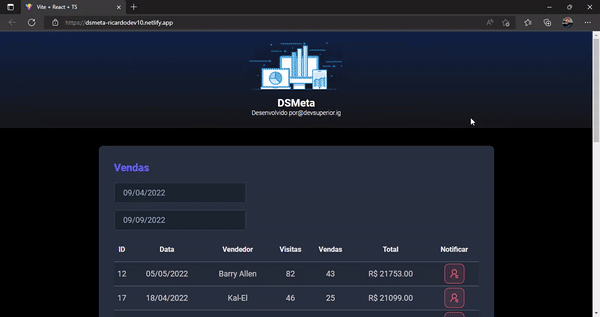

# Spring React Week

Sales listing and SMS notification 
Deploy: (https://dsmeta-ricardodev10.netlify.app/)

## Demonstration

## Learnings

Project that gave me a better understanding of ReactJS and SpringBoot library, I use Postman, Heroku and H2 database.

## Functionalities

- Sales listing
- SMS notification
- Responsive

## Stack used

**Front-end:** React, TypeScript.

**Back-end:** Spring, Node, SQL.

## Improvements

Refactorings, performance and accessibility.

## Feedback

If you have any feedback, please send it to me at ricardodev10@yahoo.com

## Author

- [@ricardodev10](https://www.github.com/ricardodev10)